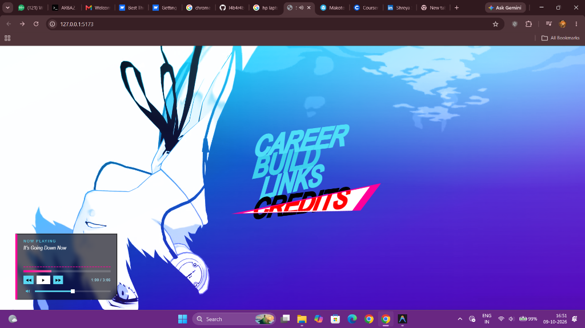
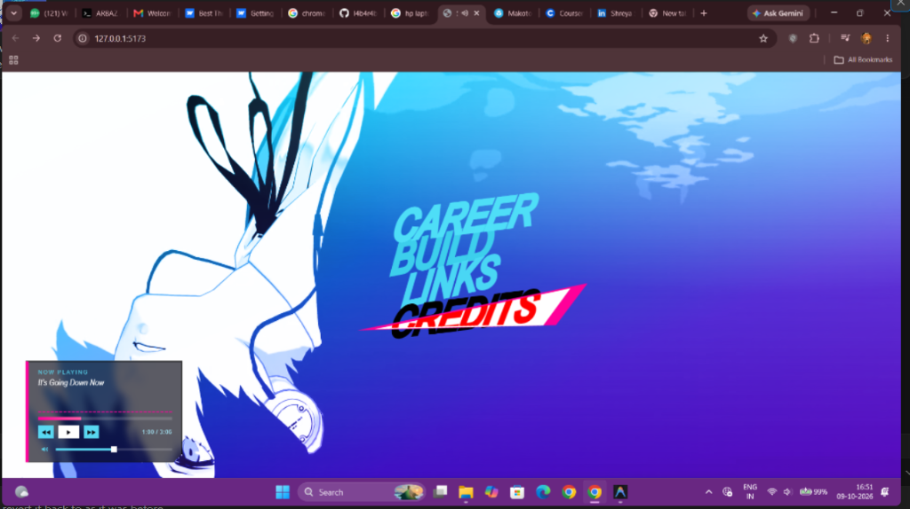
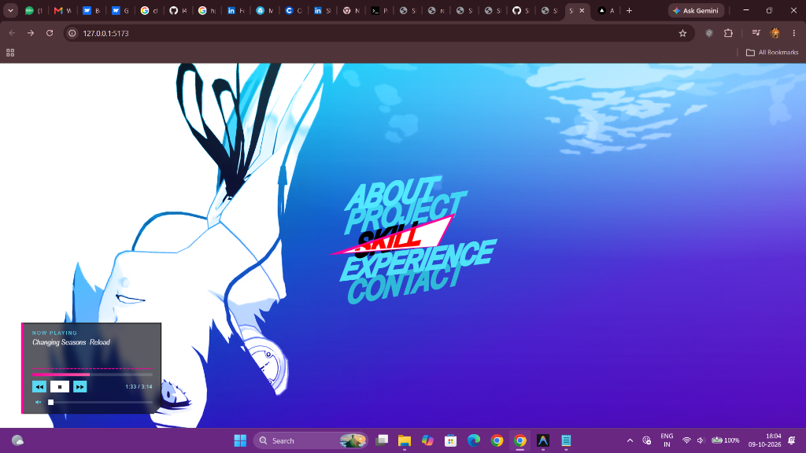
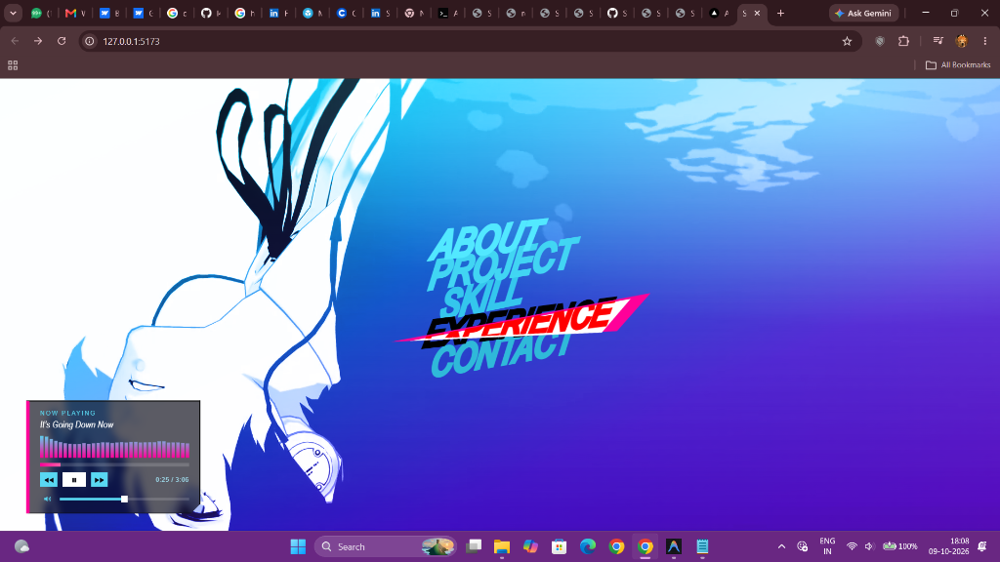
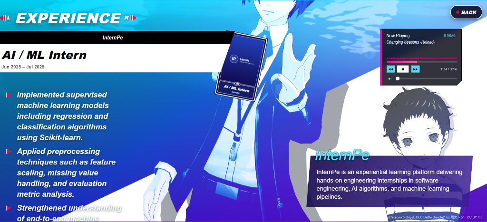
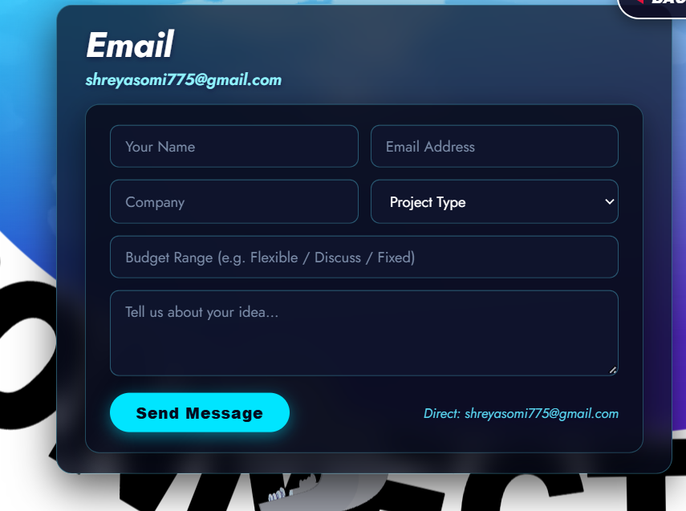
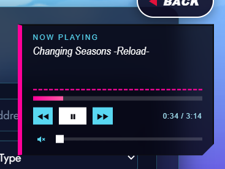

# 🌙 Persona 3 Reload — Developer Portfolio

<div align="center">

  

  <br/><br/>

  [](https://persona-portfolio-shreya.vercel.app)
  [](https://vitejs.dev/)
  [](https://react.dev/)
  [](https://threejs.org/)
  [](https://www.typescriptlang.org/)

  <p align="center">
    <strong>An authentic, cinematic interactive portfolio inspired by the UI of <i>Persona 3 Reload</i>.</strong><br/>
    Featuring 3D tarot card inspect scenes, authentic sound effects, OST background audio player, and custom slanted typography.
  </p>

  <p align="center">
    <a href="#-features">Features</a> •
    <a href="#-gallery--screenshots">Gallery</a> •
    <a href="#-tech-stack">Tech Stack</a> •
    <a href="#-getting-started">Getting Started</a> •
    <a href="#-deployment">Deployment</a> •
    <a href="#-contact">Contact</a>
  </p>

</div>

---

## ✨ Overview

This portfolio brings the visual aesthetic of **ATLUS’s Persona 3 Reload** to the web. Designed for **Shreya Somi** (Game Developer, AI Power User & Tech Wizard), it combines game-engine level UI responsiveness with modern web technologies:

- 🎮 **3D Real-time Scene**: Interactive Three.js protagonist & tarot cards with dynamic shaders, tilt physics, and smooth camera rotations.
- 🎵 **Draggable BGM Player**: Full Persona 3 Reload OST tracks with draggable floating controls, seeking scrubber, and volume memory.
- ⚡ **Authentic UI & SFX**: Crisp slant layouts, P3R-accurate cyan & magenta color grading, custom sound effects on hovers, selects, and page turns.
- 📬 **Live Contact Portal**: Direct-delivery email system with FormSubmit and real-time GitHub activity heatmaps.

---

## 📸 Gallery & Screenshots

### 1. Main Landing Menu
> Slanted high-contrast camp navigation with fluid transitions and background video backdrop.

<div align="center">
  
</div>

<br/>

### 2. About Me (`/about`)
> Dark-themed profile overview featuring developer focus, core stack, interests list, and gaming hobbies.

<div align="center">
  
</div>

<br/>

### 3. Projects Showcase (`/projects`)
> Featured game development & AI applications with clean left tag selectors and interactive right detail cards.

<div align="center">
  
</div>

<br/>

### 4. Toolbox & Skills (`/skills`)
> Categorized skills spanning Game Development (Unity/Unreal), AI & Machine Learning, Web & Backend, and Design/XR under a spinning 3D text ring.

<div align="center">
  
</div>

<br/>

### 5. Experience Detail (`/experience`)
> Career journey with real-time 3D tarot cards in Makoto Yuki's hand, company badges, and detailed achievement bullets.

<div align="center">
  
</div>

<br/>

### 6. Interactive Contact & Direct Email (`/contact`)
> Connected email portal sending messages directly to `shreyasomi775@gmail.com`, accompanied by floating LinkedIn & live GitHub cards.

<div align="center">
  
</div>

<br/>

### 7. Draggable BGM Music Player
> Fully movable across the viewport with pointer events, playback controls, and volume persistence.

<div align="center">
  
</div>

---

## 🛠️ Tech Stack

| Category | Technologies |
| :--- | :--- |
| **Frontend Framework** | [React 19](https://react.dev/), [TypeScript](https://www.typescriptlang.org/) |
| **Bundler & Tooling** | [Vite 8](https://vitejs.dev/) |
| **3D Rendering** | [Three.js](https://threejs.org/) (GLTF/GLB models, custom shaders, IK rigs) |
| **Routing** | [React Router v7](https://reactrouter.com/) |
| **Audio Engine** | Web Audio API (HTML5 Audio, spatial SFX synthesizer) |
| **Styles** | Vanilla CSS3 (Custom design system, clip-path polygons, viewport units) |
| **Email Service** | [FormSubmit](https://formsubmit.co/) (AJAX API direct inbox delivery) |
| **Deployment** | [Vercel](https://vercel.com/) / [GitHub Pages](https://pages.github.com/) |

---

## 🚀 Getting Started

### Prerequisites
- [Node.js](https://nodejs.org/) (version 18 or newer recommended)
- [npm](https://www.npmjs.com/)

### Installation

1. **Clone the repository:**
   ```bash
   git clone https://github.com/Shhhreyaaa/Persona_portfolio.git
   cd Persona_portfolio
   ```

2. **Install dependencies:**
   ```bash
   npm install
   ```

3. **Start local development server:**
   ```bash
   npm run dev
   ```

4. **Open in browser:**
   ```
   http://localhost:5173
   ```

### Production Build

```bash
npm run build
```
The optimized bundle will be generated in the `dist/` directory.

---

## 🌐 Deploying to Vercel

1. Import this repository into [Vercel](https://vercel.com/new).
2. The project uses Vite — Vercel detects this automatically.
3. The included [`vercel.json`](./vercel.json) handles client-side SPA routing (`/about`, `/projects`, `/skills`, `/experience`, `/contact`) without 404 errors.
4. Click **Deploy**!

---

## 📬 Contact & Connect

- **Email**: [shreyasomi775@gmail.com](mailto:shreyasomi775@gmail.com)
- **LinkedIn**: [linkedin.com/in/shreyasomi77](https://www.linkedin.com/in/shreyasomi77/)
- **GitHub**: [github.com/Shhhreyaaa](https://github.com/Shhhreyaaa)

---

## ⚖️ Credits & Acknowledgements

- **Visual Inspiration & Audio**: *Persona 3 Reload* © [ATLUS](https://atlus.com/) / [SEGA](https://www.sega.com/).
- **Original Camp Concept**: Inspired by David Yappeter's Persona 3 web experiment.
- **3D Character Model**: *Makoto Yuki (Battle Bundle)* by 雨宮レン (Licensed under CC BY 4.0).
- **Audio Tracks**: *Changing Seasons -Reload-*, *Color Your Night*, *Deep Breath Deep Breath -Reincarnation-*, *It's Going Down Now*.

<div align="center">
  <sub>Crafted with passion for game design and interactive systems by <strong>Shreya Somi</strong>.</sub>
</div>